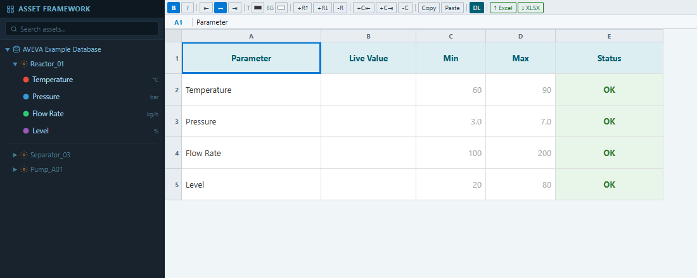
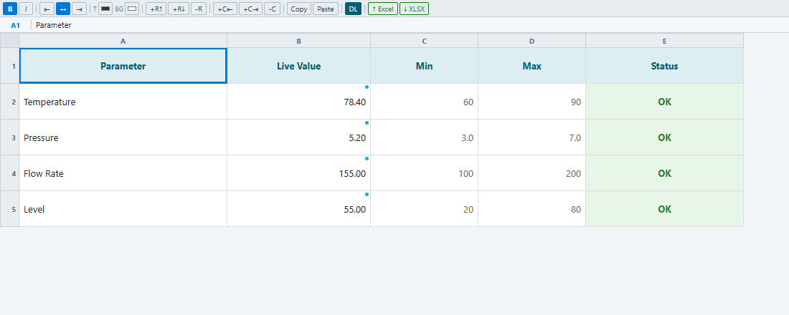
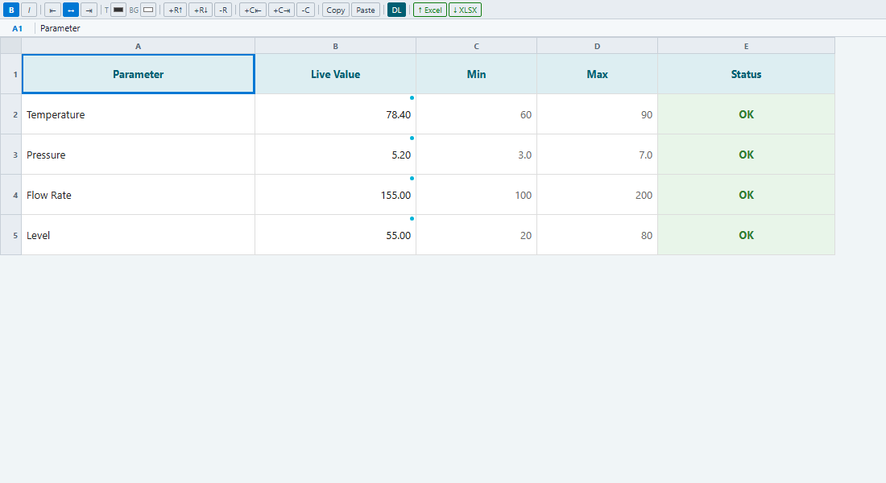
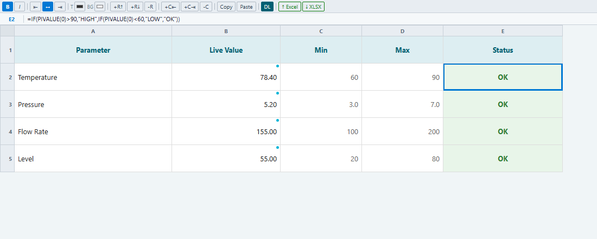
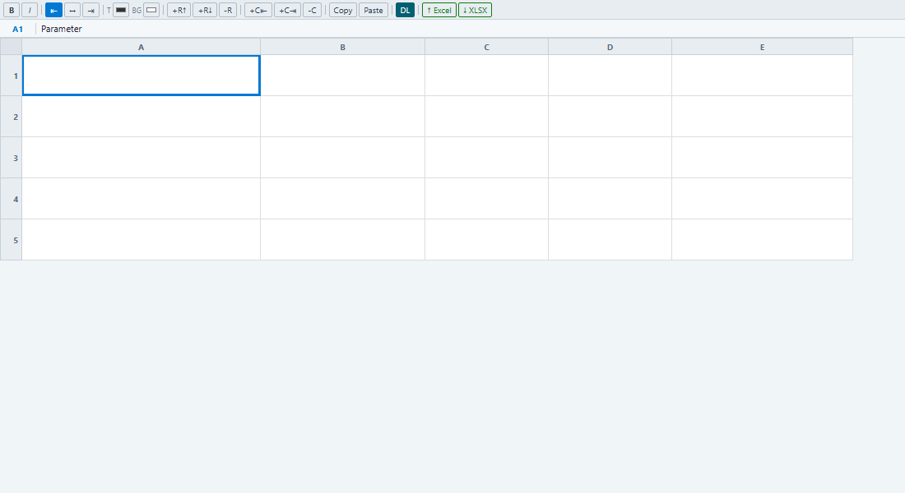
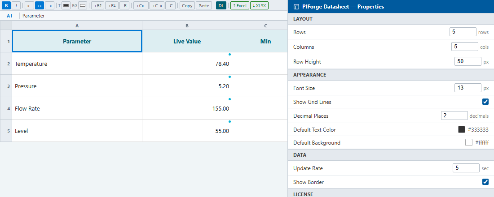

# PIForge Datasheet Pro — Pro Edition

> No scripting, no configuration dialogs — drop a tag, get live data

[](https://piforge.pages.dev)
[](https://piforge.pages.dev/product.html?id=5)

---

## Technical Showcase & Demo

Here is a live demonstration of **PIForge Datasheet Pro** running in AVEVA PI Vision:

<p align="center">
  
</p>

---

## Key Features & Live Demos

Every capability is demonstrated live in AVEVA PI Vision.

### 1. Drag PI Tags from AF Tree — Cells Bind Instantly
**No scripting, no configuration dialogs — drop a tag, get live data**

Open PIForge Datasheet in PI Vision, expand the Asset Framework tree, and drag any attribute directly onto a cell. The cell binds to the tag immediately and starts showing live values. Repeat for every row in your table.

- Works with any PI AF attribute or PI point path
- Drag from the PI Vision AF tree panel directly onto the cell
- Blue dot indicator confirms the cell is bound to a live PI stream
- Status formulas evaluate automatically once a tag is bound
- No property dialogs or code — drop and done

<p align="center">
  
</p>

---

### 2. Real-Time Values with Automatic Status Alerts
**Tag values refresh continuously — status cells change color the moment a threshold is crossed**

Once tags are bound, PIForge Datasheet refreshes live data on every PI Vision update cycle. The status column uses =IF formulas combined with Conditional Format rules: cells flip from OK (green) to HIGH (red) or LOW (amber) the instant a value crosses its threshold.

- Values update on every PI Vision data cycle — no manual refresh
- Multiple parameters monitored simultaneously
- HIGH / LOW / OK status driven by =IF(PIVALUE(n)...) formulas
- Color changes fire automatically via Conditional Format rules
- Suitable for real-time process overview and operator displays

<p align="center">
  
</p>

---

### 3. Sampled History Fills Down 10 Rows — Sparkline in One Cell
**Click [DL] · choose Sampled · Apply → time-series expands automatically**

The PI Formula Wizard (DL button) builds PI DataLink formulas without typing. In Sampled mode, one click fills a Timestamp column and a Value column with 10 historical readings at your chosen interval — exactly as PI DataLink does in Excel. Sparkline mode drops a live SVG trend chart into any single cell.

- Sampled mode: fills 10 rows of Timestamp + Value from PI history
- Interval, start, and end time all configurable in the wizard
- Grid expands automatically to fit the output range
- Sparkline mode: renders area/line/bar mini-chart inside the cell
- All 4 modes: Current, Archive, Sampled, Sparkline

<p align="center">
  
</p>

---

### 4. =IF Formulas + Conditional Format = No-Code Status Logic
**Formula bar shows the expression · CF rules drive the color · all live**

Select any status cell to see its =IF formula in the formula bar. Open the Conditional Format panel to inspect or edit the rules that control cell color. As values animate through HIGH and LOW states, the cells respond in real time — no scripting, no separate alarm system required.

- =IF(PIVALUE(n)>threshold,"HIGH","OK") — readable, no-code logic
- Conditional Format panel shows all rules for a cell in one view
- Rules: ==OK → green · !=OK → red — first match wins
- Multiple cells can each have independent CF rule sets
- Formula + CF together replace custom AngularJS scripting

<p align="center">
  
</p>

---

### 5. Load Any .xlsx Template — All 5 Sections, Then Download Back
**↑Excel loads your ops report structure · ↓XLSX exports the live grid**

Click ↑Excel to import a daily operations report template. PIForge Datasheet preserves the full structure — section headers (Key Process Values, Alarms & Events, Production Summary, Quality Results), column headers, and all row labels. Once PI tags are bound to the live columns, click ↓XLSX to export the populated grid back to Excel.

- Imports the full report structure: 5 sections, 39 rows, 7 columns
- Section headers rendered with dark navy background for clarity
- After import, bind PI tags to value cells via drag-and-drop
- ↓XLSX exports the current live grid snapshot back to .xlsx
- Round-trip: Excel template in → live PI data → Excel report out

<p align="center">
  
</p>

---

### 6. Grid Lines, Font Size, Decimal Precision, Grid Resize
**One symbol — adapt to status tiles, operator dashboards, and full reports**

Toggle grid lines for structured or clean tile layouts, scale the font for your display distance, and adjust decimal precision for the right level of detail. Resize the grid from a 3×3 quick-look tile to an 8×6 full parameter report — all without rebuilding.

- ShowGridLines: structured table or clean KPI tile
- FontSize: 8–32px — scale for control room or office display
- Decimal places: 0 for overviews, 2–3 for precision measurements
- Grid resize: 1×1 to 50×26 cells — reflows instantly
- All controls in the PI Vision configuration panel — no code

<p align="center">
  
</p>

---

### 7. PI Vision Properties Panel — All Settings in One Place
**Rows, columns, font, grid lines, decimal places — live preview as you type**

Every PIForge Datasheet property is exposed in the standard PI Vision configuration panel. Change Rows or Columns and the grid reflows instantly. Adjust Font Size, toggle grid lines, or set Decimal Places — the symbol updates in real time without leaving the panel. The License row confirms the symbol is activated.

- LAYOUT: Rows and Columns — grid reflows immediately on change
- APPEARANCE: Font Size, Show Grid Lines, Decimal Places, colors
- DATA: Update Rate, Border — control refresh and frame style
- LICENSE: Key and Status — confirm activation at a glance
- Standard PI Vision panel — no custom UI, familiar to all PI Vision users

<p align="center">
  
</p>

---


## Installation Guide

Setting up **PIForge Datasheet Pro** is quick and straightforward. Follow these steps:

### 1. Deploy Files to PI Vision Server
Extract the downloaded ZIP package. You will find HTML, JS, CSS/SVG, and image files. Copy these files to your PI Vision server's extension folder:
```cmd
%PIHOME%\Scripts\app\editor\symbols\ext
```
*Typically, this path translates to:*
```cmd
C:\Program Files\PIPC\PIVision\Scripts\app\editor\symbols\ext
```

### 2. Unblock Windows Files (Critical)
Windows blocks downloaded files by default. If you skip this step, the symbol will silently fail to load in PI Vision.
1. Right-click the `.js` and `.html` files you copied on the server.
2. Select **Properties** from the context menu.
3. On the **General** tab, look for the security warning at the bottom: *This file came from another computer and might be blocked to help protect this computer.*
4. Check the **Unblock** box, then click **Apply** and **OK**.
5. Repeat this for all files in the package.

### 3. License Key Activation
1. Log in to your PIForge Dashboard and go to **My Licenses** to copy your License Key (format: `XXXX-XXXX-XXXX-XXXX`).
2. Open PI Vision, add the symbol to a display.
3. Click the **Format Symbol (⚙)** configuration panel.
4. Paste your key into the **License Key** field and click **Activate**.

---

## Compatibility Reference

In PI Vision, go to **Help → About** to verify your version number.

| PI Vision Version | Datasheet Pro Support | Notes |
| --- | --- | --- |
| **2022+** | Full Support | Recommended |
| **2021** | Full Support | |
| **2020** | Full Support | |
| **2019** | Partial Support | Some features may be limited |
| **2018 or older** | Not Supported | |

---

## Troubleshooting & Support

### Symbol does not appear in the PI Vision palette
* Verify the files are copied to the correct `ext` directory on the **PI Vision server** (not your local machine).
* Perform a hard browser refresh: `Ctrl + Shift + R`.
* Ensure all files are unblocked (see step 2 of the Installation Guide).

### Symbol loads but displays blank or shows error
* Open Browser DevTools (`F12`) and check the **Console** tab for red errors.
* Verify the license key has no extra spaces.
* Try restarting IIS on the PI Vision server. Run this command in an Administrator command prompt:
  ```cmd
  iisreset
  ```

### Need Support?
* If you run into issues, copy your license key and contact us at **contact.piforge@gmail.com** for assistance.

---

👉 **[Purchase and Download the Pro Version at piforge.pages.dev](https://piforge.pages.dev/product.html?id=5)**

*PIForge is not affiliated with AVEVA Group plc or OSIsoft LLC.*
